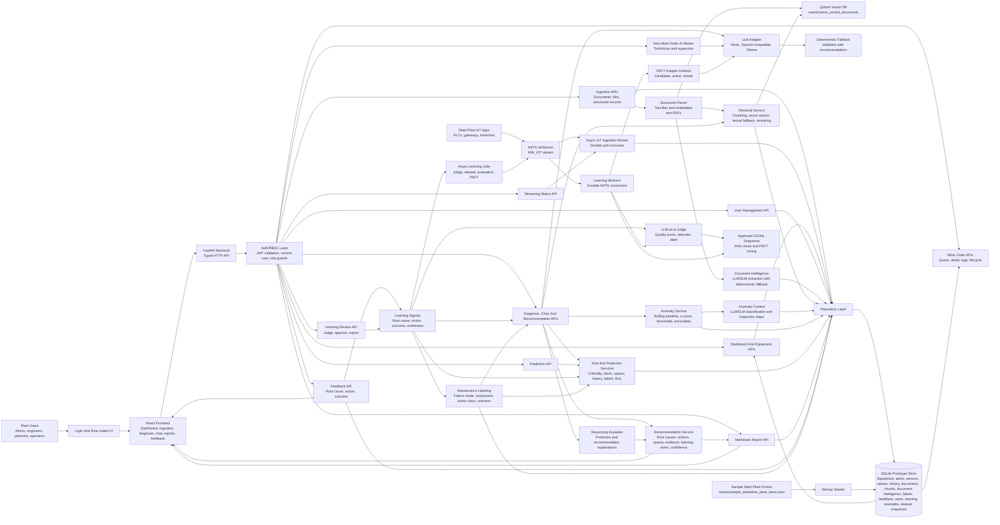

# Maintenance Wizard Architecture

## System Diagram

## Components

- React frontend: operational dashboard, company Assets table, lazy-loaded data-backed asset detail views, work-order queue/detail/execution/review screens, left-nav ingestion view, maintenance chat, recommendation, report, detailed feedback, and Learning Review views.
- Auth/RBAC layer: local login, JWT validation, current-user context, role guards, and role-aware navigation for admin, maintenance engineer, maintenance technician, maintenance supervisor, reliability engineer, planner, operator, and API-only IoT service users.
- FastAPI backend: HTTP API layer for dashboard data, work orders, role-specific assistants, ingestion, diagnosis, prediction, chat, reports, and feedback.
- Async IoT streaming ingestion: optional NATS JetStream durable consumer for plant applications, PLC gateways, and historians that publish alerts, sensor readings, equipment, spares, and maintenance events.
- Data services: seed SQLite from five sample steel-plant assets and expose repository functions for equipment, asset profiles, asset metrics, seeded asset recommendations, subsystems, reliability metrics, alerts, sensor readings, spares, maintenance history, related work orders, SOP/manual/log/history documents, document chunks, and feedback.
- Document parser: extracts text from uploaded text-like files and embedded-text PDFs before indexing.
- Document intelligence service: optional LLM/SLM extraction of uploaded document summary, assets, components, failure modes, symptoms, safety constraints, spares, and thresholds, with deterministic fallback.
- Retrieval service: production Qdrant vector database for document chunks and approved knowledge, deterministic SQLite/local-vector fallback for tests or degraded disconnected operation, lexical scoring, optional LLM/SLM reranking, and relevance reasons.
- Risk service: deterministic alert severity, asset criticality, spares constraints, and event-history scoring.
- Anomaly service: rolling-baseline and z-score analysis over persisted sensor readings, plus optional LLM/SLM context classification and inspection steps.
- Maintenance labeling service: optional LLM/SLM normalization of maintenance history and feedback into failure-mode, component, root-cause, action-class, outcome, and signal-hint labels.
- Learning service: captures assistant interactions, converts feedback/labels/work-order outcomes/documents into candidate examples, scores them with an LLM-as-a-Judge rubric, preserves human approval state, exports judge-qualified JSONL snapshots for local adapter tuning, and provides reviewer controls for model versions, evaluation runs, and artifact storage.
- Async learning workers: NATS JetStream subjects under `maintenance.learning.*` drive judge, dataset, evaluation, and PEFT preparation jobs outside the FastAPI request path with retries, DLQ handling, persisted job status, and filesystem or S3-compatible artifact registration.
- Recommendation service: combines retrieved evidence, approved judge-qualified learning examples, risk scoring, prediction, normalized labels, prior engineer feedback, reasoning explanations, and optional LLM-adapter context.
- Work-order assistant service: combines persisted work-order state, asset health, alerts, retrieved evidence, technician observations, and optional LLM/SLM output to suggest live directions, problem codes, completion summaries, supervisor follow-ups, and draft follow-up work. Neo has role-aware work-order modes: technician mode is restricted to `maintenance_technician`, and supervisor mode is restricted to `maintenance_supervisor`; both use the shared LLM provider, model, token-limit, and streaming configuration. Dashboard Neo starts with a deterministic role-aware welcome and attention table, then routes deterministic role-aware commands for asset section summaries, assigned-work next steps, work-order creation/status updates, and admin user management through backend repository functions. Chat panels consume streaming SSE responses and apply final structured events for app-owned fields.
- Report service: formats recommendations as structured Markdown for supervisor handoff or demo export, including learning notes.
- LLM adapter: common structured interface for mock, OpenAI-compatible chat completions, and Ollama chat providers.

## API Surface

- Authentication and authorization:
  - `POST /api/auth/login` returns a JWT bearer token for active users.
  - `GET /api/auth/me` returns the current authenticated user and role.
  - `POST /api/auth/logout` lets the frontend clear the current session.
  - Admin-only user management endpoints create, update, deactivate, and reset users.
  - `/api/health` remains public; maintenance data and action endpoints require authentication and role checks.

- Ingestion:
  - `POST /api/ingest/documents` stores JSON document records, rebuilds retrieval chunks, and extracts document intelligence.
  - `POST /api/ingest/document-file` parses and stores uploaded `.txt`, `.md`, `.markdown`, `.csv`, `.log`, `.json`, and embedded-text `.pdf` files, then extracts document intelligence.
  - `POST /api/ingest/records` upserts structured equipment, alert, spare, sensor reading, and maintenance event records.
  - `GET /api/streaming/status` reports NATS JetStream ingestion state, processed count, failed count, last message timestamp, and last error.
- Decision support:
  - `GET /api/dashboard/summary` returns plant-level health and all tracked assets sorted by risk priority.
  - `GET /api/assets` returns the company asset table with location, criticality, health, risk, work-order count, and supervisor fields.
  - `GET /api/assets/{equipment_id}` returns data-backed asset detail sections for profile, metrics, recommendations, subsystems, maintenance history, work orders, performance series, reliability metrics, SOP/manual/log/history documents, retrieval evidence, and prediction drivers. The `sections` query parameter lets the UI load Summary first and hydrate heavier tabs on demand without pulling maintenance, performance, reliability, or document payloads into the initial Summary request.
  - `GET /api/equipment/{equipment_id}/health` returns asset risk, anomalies, alerts, spares constraints, and notes.
  - `GET /api/equipment/{equipment_id}/anomalies` returns rolling-baseline anomaly findings.
  - `GET /api/equipment/{equipment_id}/document-intelligence` returns extracted document intelligence profiles.
  - `GET /api/equipment/{equipment_id}/maintenance-labels` returns stored normalized maintenance labels.
  - `POST /api/equipment/{equipment_id}/maintenance-labels` generates normalized labels from history and feedback.
  - `POST /api/chat` and `POST /api/diagnose` generate evidence-backed recommendations.
  - `POST /api/predict` returns failure probability, estimated RUL, and drivers.
- Work orders and assistants:
  - `GET /api/work-orders` lists work orders, with optional asset and follow-up filters.
  - `POST /api/work-orders` creates a work order with assignment, priority, problem code, recommended action, and follow-up fields.
  - `GET /api/work-orders/{work_order_id}` returns detail and work logs.
  - `PATCH /api/work-orders/{work_order_id}` updates lifecycle status, assignment, problem code, follow-up, and completion summary.
  - `POST /api/work-orders/{work_order_id}/logs` appends technician, supervisor, or assistant log entries.
  - `POST /api/work-orders/technician-assist` returns LLM-backed live directions, safety reminders, recommended actions, problem-code suggestions, and completion summary for technician users only.
  - `POST /api/work-orders/supervisor-assist` summarizes queue/follow-up risk and can draft a follow-up work order for supervisor users only.
- Reporting and learning:
  - `GET /api/reports/{equipment_id}/markdown` exports a structured maintenance decision report.
  - `POST /api/recommendations/{recommendation_id}/feedback` stores engineer feedback with equipment id, status, corrected diagnosis, actual root cause, action taken, outcome, and notes.
  - `GET /api/learning/summary` returns learning counts, recent judged examples, model versions, prompt versions, and dataset snapshots for reviewer roles.
  - `POST /api/learning/examples/refresh` generates or refreshes candidate examples and applies the LLM-as-a-Judge scoring rubric.
  - `GET /api/learning/examples` lists judged examples for approval review.
  - `PATCH /api/learning/examples/{example_id}` updates human approval state without changing the judge score.
  - `POST /api/learning/examples/{example_id}/judge` reruns the judge on a selected example.
  - `POST /api/learning/datasets` creates an approved, judge-threshold-filtered JSONL snapshot.
  - `GET /api/learning/datasets/{dataset_id}/jsonl` downloads a JSONL tuning snapshot.
  - `POST /api/learning/model-versions` registers a local or offline PEFT adapter candidate.
  - `POST /api/learning/evaluations` records an evaluation run for a dataset/model/prompt combination.
  - `GET /api/learning/evaluations` lists recent evaluation runs.
  - `GET /api/learning/jobs` lists recent persisted learning jobs.
  - `POST /api/learning/rag/reindex` rebuilds document chunks and reindexes them into the configured RAG vector store for reviewer roles.
  - `POST /api/learning/jobs/peft` queues a PEFT tuning job for a dataset/model/prompt combination and publishes it to NATS when async learning is enabled. The learning worker prepares JSONL dataset and training-manifest artifacts, stores them through the configured artifact backend, and records their hashes and URIs.

## Data Flow

1. Sample plant records for the hot strip mill drive, blast furnace blower, caster cooling pump, hydraulic system, and overhead crane are loaded from `assets/sample_data/steel_plant_demo.json` and upserted into SQLite on startup.
2. File and JSON document ingestion endpoints parse manuals, SOPs, logs, CSVs, JSON, Markdown, text files, and embedded-text PDFs into document records and retrieval chunks, then extract structured document intelligence.
3. Structured record ingestion upserts equipment, alerts, spares, sensor readings, and maintenance events; maintenance events can be normalized into reusable labels.
4. Optional NATS JetStream ingestion consumes plant IoT messages asynchronously and persists validated payloads through the same repository path.
5. API endpoints read and write typed records through the repository layer.
6. Auth/RBAC guards validate JWTs and role permissions before maintenance data or actions are served.
7. Dashboard and equipment endpoints expose plant health, the full priority-sorted asset list, asset risk, anomaly findings, alert context, and spares constraints.
8. Chat or diagnosis requests trigger Qdrant-backed vector retrieval over persisted document chunks plus matching maintenance history, with SQLite/local-vector fallback, embedding profile/version metadata, optional LLM/SLM reranking, and relevance reasons.
9. Anomaly service evaluates sensor readings by signal using rolling baseline, z-score, threshold breach, and trend delta, then classifies context and inspection steps when enrichment is enabled.
10. Risk and prediction services combine alerts, anomaly findings, asset criticality, spares constraints, maintenance history, normalized labels, and feedback signals to compute health score, risk level, failure probability, and estimated RUL.
11. Recommendation service requests structured LLM context when configured, validates it, merges safe suggestions with deterministic fallback actions and prior engineer feedback, and returns diagnosis, root causes, actions, spares strategy, learning notes, reasoning explanation, confidence, and evidence.
12. Report service converts recommendations into Markdown with diagnosis, risk, RUL, actions, spares strategy, learning notes, reasoning explanation, evidence, and summary.
13. Feedback is stored in SQLite, normalized into labels, and reused in future recommendation prompts, deterministic action/root-cause ranking, learning notes, reports, and prediction drivers.
14. Candidate training examples are built from feedback, labels, completed work orders, approved assistant interactions, and ingested documents, then scored by LLM-as-a-Judge with deterministic fallback.
15. Approved examples with judge scores at or above the configured threshold feed retrieval/prompt context immediately and can be exported as JSONL snapshots for offline PEFT/LoRA tuning.
16. Production learning jobs publish to NATS JetStream for asynchronous judge, dataset, evaluation, and PEFT workers; workers persist job status, artifacts, metrics, and candidate model versions before any adapter is promoted. The PEFT worker prepares audited filesystem or S3-compatible artifacts and can invoke a configured external trainer with bounded timeout, then registers produced adapters as `candidate` model versions only.

## LLM Boundaries

LLM/SLM use is isolated behind validated service contracts. Diagnosis, chat, and report endpoints call the recommendation pipeline, which can include optional LLM-generated root causes, immediate actions, planned actions, summaries, confidence adjustment, and reasoning explanation. Document ingestion, retrieval, anomaly context, maintenance labeling, technician work-order assistance, and supervisor follow-up review can also call the same provider adapter for structured enrichment.

The LLM/SLM is not the source of truth for raw ingestion, NATS streaming ingestion, deterministic anomaly scores, risk scoring, RUL calculation, dashboard aggregation, work-order persistence, status transitions, or feedback persistence. These parts remain deterministic so the demo works without external credentials.

Provider output must validate to the expected structured JSON contract. Missing credentials, network errors, malformed JSON, invalid schema, or provider timeout automatically fall back to deterministic local reasoning.

## Continuous Improvement

Engineer feedback is persisted with equipment context and then reused through a RAG-first, PEFT-ready learning loop:

- Accepted/corrected actual root causes can be promoted in future root-cause suggestions.
- Confirmed actions can be surfaced in immediate and planned actions.
- Feedback notes are included in future LLM prompt context.
- Feedback and maintenance history are normalized into labels used as prediction drivers and candidate training signals.
- Candidate examples are judged by an LLM-as-a-Judge rubric for specificity, outcome evidence, safety, role suitability, and hallucination risk.
- Human approval remains a separate control: judge score alone cannot export an example for tuning.
- Approved examples above the default `0.65` judge threshold are available to retrieval and recommendation prompts as high-quality learning context; production retrieval uses Qdrant so approved knowledge can scale beyond SQLite scans.
- The same approved, judge-qualified examples can be exported as JSONL for offline local PEFT/LoRA adapter tuning.
- Persisted `learning_jobs` records provide an audit trail for refresh, judge, dataset, evaluation, adapter registration, and PEFT tuning requests.
- NATS JetStream is the production async backbone for large judge, dataset, evaluation, and PEFT jobs. PEFT queue requests publish to NATS when `LEARNING_ASYNC_ENABLED=true`; the worker consumes those jobs and prepares durable filesystem or S3-compatible artifacts while synchronous reviewer actions remain available only for small local/demo reviewer flows.
- Learning notes appear in recommendations and Markdown reports.
- Prediction drivers include feedback count, confirmed root causes, outcomes, normalized maintenance labels, and bounded risk adjustments.

This is not automated online self-training. The prototype supports auditable RAG reuse, PEFT-ready dataset preparation, persisted learning jobs, NATS worker execution, local or S3-compatible PEFT artifact storage, artifact hashes, optional external PEFT trainer execution, and PEFT job queueing; production training remains an explicit NATS-backed offline/admin-controlled workflow with bundled trainer templates, object bucket lifecycle controls, evaluation, and promotion gates.

## Current Prototype Limits

- Retrieval now defaults to Qdrant for production-grade vector storage while retaining deterministic local embeddings and SQLite fallback for offline tests. A stronger embedding model remains a production hardening item, and LLM/SLM reranking improves ordering when configured.
- LLM providers are optional at runtime. Invalid provider responses, missing credentials, or network failures fall back to deterministic reasoning.
- SQLite persistence is implemented for the prototype data model. A lightweight startup migration exists for `feedback.equipment_id`; full migration tooling is still a production hardening item.
- NATS JetStream ingestion is implemented as a production runtime path and requires an external NATS server when `STREAMING_ENABLED=true` or `LEARNING_ASYNC_ENABLED=true`.
- Authentication and role-based authorization use local SQLite users and JWT bearer tokens. Production SSO remains a hardening item.
- Live LLM calls are available through provider adapters when configured; deterministic fallback output remains the default local-demo behavior.
- LLM-as-a-Judge scoring improves dataset quality but is not a safety authority. Role checks, schema validation, approval controls, and deterministic backend workflow rules remain authoritative.
- Anomaly scoring and RUL are heuristic and intended for demonstration until richer plant time-series data exists. LLM/SLM enrichment classifies and explains results but does not compute final risk or RUL.
- PDF extraction depends on embedded text; scanned PDFs would need OCR in a production version.
