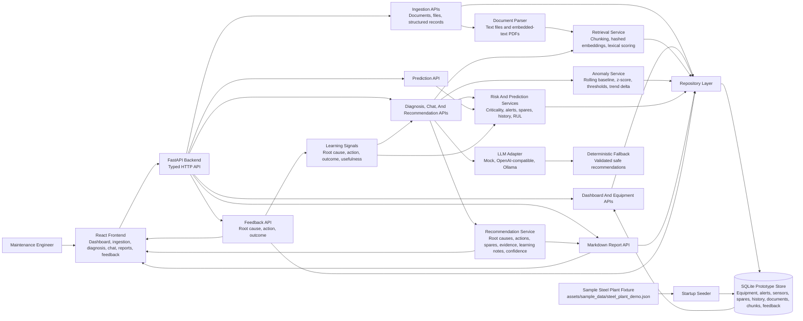

# Maintenance Wizard Architecture

## System Diagram

## Components

- React frontend: operator dashboard, left-nav ingestion view, maintenance chat, asset detail, recommendation, report, and detailed feedback views.
- FastAPI backend: HTTP API layer for dashboard data, ingestion, diagnosis, prediction, chat, reports, and feedback.
- Data services: seed SQLite from five sample steel-plant assets and expose repository functions for equipment, alerts, sensor readings, spares, maintenance history, documents, document chunks, and feedback.
- Document parser: extracts text from uploaded text-like files and embedded-text PDFs before indexing.
- Retrieval service: local chunk index persisted in SQLite with deterministic hashed embeddings and lexical scoring.
- Risk service: deterministic alert severity, asset criticality, spares constraints, and event-history scoring.
- Anomaly service: rolling-baseline and z-score analysis over persisted sensor readings.
- Recommendation service: combines retrieved evidence, risk scoring, prediction, prior engineer feedback, and optional LLM-adapter context.
- Report service: formats recommendations as structured Markdown for supervisor handoff or demo export, including learning notes.
- LLM adapter: common structured interface for mock, OpenAI-compatible chat completions, and Ollama chat providers.

## API Surface

- Ingestion:
  - `POST /api/ingest/documents` stores JSON document records and rebuilds retrieval chunks.
  - `POST /api/ingest/document-file` parses and stores uploaded `.txt`, `.md`, `.markdown`, `.csv`, `.log`, `.json`, and embedded-text `.pdf` files.
  - `POST /api/ingest/records` upserts structured equipment, alert, spare, sensor reading, and maintenance event records.
- Decision support:
  - `GET /api/dashboard/summary` returns plant-level health and all tracked assets sorted by risk priority.
  - `GET /api/equipment/{equipment_id}/health` returns asset risk, anomalies, alerts, spares constraints, and notes.
  - `GET /api/equipment/{equipment_id}/anomalies` returns rolling-baseline anomaly findings.
  - `POST /api/chat` and `POST /api/diagnose` generate evidence-backed recommendations.
  - `POST /api/predict` returns failure probability, estimated RUL, and drivers.
- Reporting and learning:
  - `GET /api/reports/{equipment_id}/markdown` exports a structured maintenance decision report.
  - `POST /api/recommendations/{recommendation_id}/feedback` stores engineer feedback with equipment id, status, corrected diagnosis, actual root cause, action taken, outcome, and notes.

## Data Flow

1. Sample plant records for the hot strip mill drive, blast furnace blower, caster cooling pump, hydraulic system, and overhead crane are loaded from `assets/sample_data/steel_plant_demo.json` and upserted into SQLite on startup.
2. File and JSON document ingestion endpoints parse manuals, SOPs, logs, CSVs, JSON, Markdown, text files, and embedded-text PDFs into document records and retrieval chunks.
3. Structured record ingestion upserts equipment, alerts, spares, sensor readings, and maintenance events.
4. API endpoints read and write typed records through the repository layer.
5. Dashboard and equipment endpoints expose plant health, the full priority-sorted asset list, asset risk, anomaly findings, alert context, and spares constraints.
6. Chat or diagnosis requests trigger local retrieval over persisted document chunks plus matching maintenance history.
7. Anomaly service evaluates sensor readings by signal using rolling baseline, z-score, threshold breach, and trend delta.
8. Risk and prediction services combine alerts, anomaly findings, asset criticality, spares constraints, maintenance history, and feedback signals to compute health score, risk level, failure probability, and estimated RUL.
9. Recommendation service requests structured LLM context when configured, validates it, merges safe suggestions with deterministic fallback actions and prior engineer feedback, and returns diagnosis, root causes, actions, spares strategy, learning notes, confidence, and evidence.
10. Report service converts recommendations into Markdown with diagnosis, risk, RUL, actions, spares strategy, learning notes, evidence, and summary.
11. Feedback is stored in SQLite and reused in future recommendation prompts, deterministic action/root-cause ranking, learning notes, reports, and prediction drivers.

## LLM Boundaries

LLM use is isolated to recommendation generation. Diagnosis, chat, and report endpoints all call the same recommendation pipeline, so they can include optional LLM-generated root causes, immediate actions, planned actions, summaries, and confidence adjustment.

The LLM is not involved in raw ingestion, deterministic anomaly detection, risk scoring, RUL calculation, dashboard aggregation, or feedback persistence. These parts remain deterministic so the demo works without external credentials.

Provider output must validate to the expected structured JSON contract. Missing credentials, network errors, malformed JSON, invalid schema, or provider timeout automatically fall back to deterministic local reasoning.

## Continuous Improvement

Engineer feedback is persisted with equipment context and then reused without retraining:

- Accepted/corrected actual root causes can be promoted in future root-cause suggestions.
- Confirmed actions can be surfaced in immediate and planned actions.
- Feedback notes are included in future LLM prompt context.
- Learning notes appear in recommendations and Markdown reports.
- Prediction drivers include feedback count, confirmed root causes, outcomes, and a bounded feedback risk adjustment.

This is a prototype learning loop based on feedback reuse and ranking influence. It is not a trained predictive model or automated retraining pipeline.

## Current Prototype Limits

- Retrieval uses deterministic local embeddings suitable for offline demo use; production should replace this with a stronger embedding model and vector database.
- LLM providers are optional at runtime. Invalid provider responses, missing credentials, or network failures fall back to deterministic reasoning.
- SQLite persistence is implemented for the prototype data model. A lightweight startup migration exists for `feedback.equipment_id`; full migration tooling is still a production hardening item.
- Live LLM calls are available through provider adapters when configured; deterministic fallback output remains the default local-demo behavior.
- Anomaly detection and RUL are heuristic and intended for demonstration until richer plant time-series data exists.
- PDF extraction depends on embedded text; scanned PDFs would need OCR in a production version.
