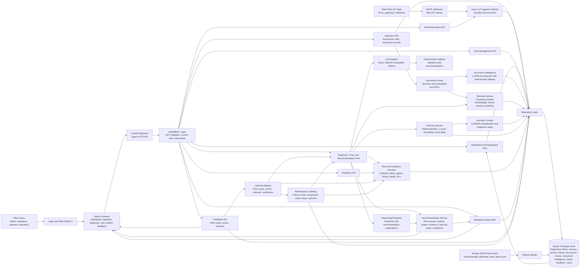

# Maintenance Wizard Architecture

## System Diagram

## Components

- React frontend: operator dashboard, left-nav ingestion view, maintenance chat, asset detail, recommendation, report, and detailed feedback views.
- Auth/RBAC layer: local login, JWT validation, current-user context, role guards, and role-aware navigation for admin, maintenance engineer, reliability engineer, planner, operator, and API-only IoT service users.
- FastAPI backend: HTTP API layer for dashboard data, ingestion, diagnosis, prediction, chat, reports, and feedback.
- Async IoT streaming ingestion: optional NATS JetStream durable consumer for plant applications, PLC gateways, and historians that publish alerts, sensor readings, equipment, spares, and maintenance events.
- Data services: seed SQLite from five sample steel-plant assets and expose repository functions for equipment, alerts, sensor readings, spares, maintenance history, documents, document chunks, and feedback.
- Document parser: extracts text from uploaded text-like files and embedded-text PDFs before indexing.
- Document intelligence service: optional LLM/SLM extraction of uploaded document summary, assets, components, failure modes, symptoms, safety constraints, spares, and thresholds, with deterministic fallback.
- Retrieval service: local chunk index persisted in SQLite with deterministic hashed embeddings, lexical scoring, optional LLM/SLM reranking, and relevance reasons.
- Risk service: deterministic alert severity, asset criticality, spares constraints, and event-history scoring.
- Anomaly service: rolling-baseline and z-score analysis over persisted sensor readings, plus optional LLM/SLM context classification and inspection steps.
- Maintenance labeling service: optional LLM/SLM normalization of maintenance history and feedback into failure-mode, component, root-cause, action-class, outcome, and signal-hint labels.
- Recommendation service: combines retrieved evidence, risk scoring, prediction, normalized labels, prior engineer feedback, reasoning explanations, and optional LLM-adapter context.
- Report service: formats recommendations as structured Markdown for supervisor handoff or demo export, including learning notes.
- LLM adapter: common structured interface for mock, OpenAI-compatible chat completions, and Ollama chat providers.

## API Surface

- Authentication and authorization:
  - `POST /api/auth/login` returns a JWT bearer token for active users.
  - `GET /api/auth/me` returns the current authenticated user and role.
  - `POST /api/auth/logout` lets the frontend clear the current session.
  - Admin-only user management endpoints create, update, deactivate, and reset users.
  - `/api/health` remains public; maintenance data and action endpoints require authentication and role checks.

- Ingestion:
  - `POST /api/ingest/documents` stores JSON document records, rebuilds retrieval chunks, and extracts document intelligence.
  - `POST /api/ingest/document-file` parses and stores uploaded `.txt`, `.md`, `.markdown`, `.csv`, `.log`, `.json`, and embedded-text `.pdf` files, then extracts document intelligence.
  - `POST /api/ingest/records` upserts structured equipment, alert, spare, sensor reading, and maintenance event records.
  - `GET /api/streaming/status` reports NATS JetStream ingestion state, processed count, failed count, last message timestamp, and last error.
- Decision support:
  - `GET /api/dashboard/summary` returns plant-level health and all tracked assets sorted by risk priority.
  - `GET /api/equipment/{equipment_id}/health` returns asset risk, anomalies, alerts, spares constraints, and notes.
  - `GET /api/equipment/{equipment_id}/anomalies` returns rolling-baseline anomaly findings.
  - `GET /api/equipment/{equipment_id}/document-intelligence` returns extracted document intelligence profiles.
  - `GET /api/equipment/{equipment_id}/maintenance-labels` returns stored normalized maintenance labels.
  - `POST /api/equipment/{equipment_id}/maintenance-labels` generates normalized labels from history and feedback.
  - `POST /api/chat` and `POST /api/diagnose` generate evidence-backed recommendations.
  - `POST /api/predict` returns failure probability, estimated RUL, and drivers.
- Reporting and learning:
  - `GET /api/reports/{equipment_id}/markdown` exports a structured maintenance decision report.
  - `POST /api/recommendations/{recommendation_id}/feedback` stores engineer feedback with equipment id, status, corrected diagnosis, actual root cause, action taken, outcome, and notes.

## Data Flow

1. Sample plant records for the hot strip mill drive, blast furnace blower, caster cooling pump, hydraulic system, and overhead crane are loaded from `assets/sample_data/steel_plant_demo.json` and upserted into SQLite on startup.
2. File and JSON document ingestion endpoints parse manuals, SOPs, logs, CSVs, JSON, Markdown, text files, and embedded-text PDFs into document records and retrieval chunks, then extract structured document intelligence.
3. Structured record ingestion upserts equipment, alerts, spares, sensor readings, and maintenance events; maintenance events can be normalized into reusable labels.
4. Optional NATS JetStream ingestion consumes plant IoT messages asynchronously and persists validated payloads through the same repository path.
5. API endpoints read and write typed records through the repository layer.
6. Auth/RBAC guards validate JWTs and role permissions before maintenance data or actions are served.
7. Dashboard and equipment endpoints expose plant health, the full priority-sorted asset list, asset risk, anomaly findings, alert context, and spares constraints.
8. Chat or diagnosis requests trigger local retrieval over persisted document chunks plus matching maintenance history, with optional LLM/SLM reranking and relevance reasons.
9. Anomaly service evaluates sensor readings by signal using rolling baseline, z-score, threshold breach, and trend delta, then classifies context and inspection steps when enrichment is enabled.
10. Risk and prediction services combine alerts, anomaly findings, asset criticality, spares constraints, maintenance history, normalized labels, and feedback signals to compute health score, risk level, failure probability, and estimated RUL.
11. Recommendation service requests structured LLM context when configured, validates it, merges safe suggestions with deterministic fallback actions and prior engineer feedback, and returns diagnosis, root causes, actions, spares strategy, learning notes, reasoning explanation, confidence, and evidence.
12. Report service converts recommendations into Markdown with diagnosis, risk, RUL, actions, spares strategy, learning notes, reasoning explanation, evidence, and summary.
13. Feedback is stored in SQLite, normalized into labels, and reused in future recommendation prompts, deterministic action/root-cause ranking, learning notes, reports, and prediction drivers.

## LLM Boundaries

LLM/SLM use is isolated behind validated service contracts. Diagnosis, chat, and report endpoints call the recommendation pipeline, which can include optional LLM-generated root causes, immediate actions, planned actions, summaries, confidence adjustment, and reasoning explanation. Document ingestion, retrieval, anomaly context, and maintenance labeling can also call the same provider adapter for structured enrichment.

The LLM/SLM is not the source of truth for raw ingestion, NATS streaming ingestion, deterministic anomaly scores, risk scoring, RUL calculation, dashboard aggregation, or feedback persistence. These parts remain deterministic so the demo works without external credentials.

Provider output must validate to the expected structured JSON contract. Missing credentials, network errors, malformed JSON, invalid schema, or provider timeout automatically fall back to deterministic local reasoning.

## Continuous Improvement

Engineer feedback is persisted with equipment context and then reused without retraining:

- Accepted/corrected actual root causes can be promoted in future root-cause suggestions.
- Confirmed actions can be surfaced in immediate and planned actions.
- Feedback notes are included in future LLM prompt context.
- Feedback and maintenance history are normalized into labels used as prediction drivers and candidate training signals.
- Learning notes appear in recommendations and Markdown reports.
- Prediction drivers include feedback count, confirmed root causes, outcomes, normalized maintenance labels, and bounded risk adjustments.

This is a prototype learning loop based on feedback reuse, label normalization, and ranking influence. It is not a trained predictive model or automated retraining pipeline.

## Current Prototype Limits

- Retrieval uses deterministic local embeddings suitable for offline demo use; production should replace this with a stronger embedding model and vector database. LLM/SLM reranking improves ordering when configured but still depends on the initial local candidate set.
- LLM providers are optional at runtime. Invalid provider responses, missing credentials, or network failures fall back to deterministic reasoning.
- SQLite persistence is implemented for the prototype data model. A lightweight startup migration exists for `feedback.equipment_id`; full migration tooling is still a production hardening item.
- NATS JetStream ingestion is implemented as an optional runtime path and requires an external NATS server when `STREAMING_ENABLED=true`.
- Authentication and role-based authorization use local SQLite users and JWT bearer tokens. Production SSO remains a hardening item.
- Live LLM calls are available through provider adapters when configured; deterministic fallback output remains the default local-demo behavior.
- Anomaly scoring and RUL are heuristic and intended for demonstration until richer plant time-series data exists. LLM/SLM enrichment classifies and explains results but does not compute final risk or RUL.
- PDF extraction depends on embedded text; scanned PDFs would need OCR in a production version.
