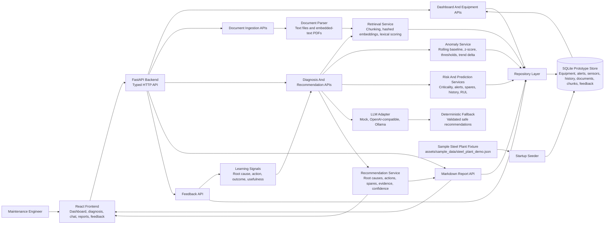

# Maintenance Wizard Architecture

## System Diagram

## Components

- React frontend: operator dashboard, maintenance chat, asset detail, recommendation, report, and feedback views.
- FastAPI backend: HTTP API layer for dashboard data, diagnosis, prediction, chat, reports, and feedback.
- Data services: seed SQLite from sample steel-plant fixtures and expose repository functions for equipment, alerts, sensor readings, spares, maintenance history, documents, and feedback.
- Document parser: extracts text from uploaded text-like files and PDFs before indexing.
- Retrieval service: local chunk index persisted in SQLite with deterministic hashed embeddings and lexical scoring.
- Risk service: deterministic alert severity, asset criticality, spares constraints, and event-history scoring.
- Anomaly service: rolling-baseline and z-score analysis over persisted sensor readings.
- Recommendation service: combines retrieved evidence, risk scoring, prediction, prior engineer feedback, and LLM-adapter context.
- Report service: formats recommendations as structured Markdown for supervisor handoff or demo export.
- LLM adapter: common structured interface for mock, OpenAI-compatible chat completions, and Ollama chat providers.

## Data Flow

1. Sample plant records are loaded from `assets/sample_data/steel_plant_demo.json` and upserted into SQLite on startup.
2. File and JSON ingestion endpoints parse manuals/SOPs/log-like files into document records.
3. API endpoints read and write typed records through the repository layer.
4. Dashboard and equipment endpoints expose plant health and alert context.
5. Chat or diagnosis requests trigger local retrieval over persisted document chunks plus matching maintenance history.
6. Anomaly service evaluates sensor readings by signal using rolling baseline, z-score, threshold breach, and trend delta.
7. Risk and prediction services combine alerts, anomaly findings, asset criticality, spares constraints, and history to compute health score, risk level, failure probability, and estimated RUL.
8. Recommendation service requests structured LLM context when configured, validates it, merges safe suggestions with deterministic fallback actions and prior engineer feedback, and returns diagnosis, root causes, actions, spares strategy, learning notes, confidence, and evidence.
9. Report service converts recommendations into Markdown with diagnosis, actions, spares strategy, evidence, and summary.
10. Feedback is stored in SQLite and reused in future recommendation prompts, deterministic action/root-cause ranking, learning notes, and prediction drivers.

## Current Prototype Limits

- Retrieval uses deterministic local embeddings suitable for offline demo use; production should replace this with a stronger embedding model and vector database.
- LLM providers are optional at runtime. Invalid provider responses, missing credentials, or network failures fall back to deterministic reasoning.
- SQLite persistence is implemented for the prototype data model; migrations are not yet implemented.
- Live LLM calls are represented by provider adapters and deterministic fallback output.
- Anomaly detection and RUL are heuristic and intended for demonstration until richer plant time-series data exists.
- PDF extraction depends on embedded text; scanned PDFs would need OCR in a production version.
