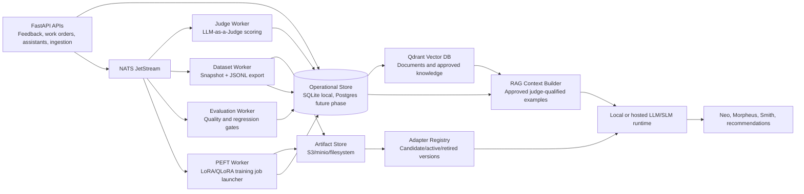

# RAG + PEFT + NATS Learning Architecture

## Goal

Make Maintenance Wizard assistants improve from plant data while preserving auditability, deterministic safety controls, and role-based authorization.

The production design combines three layers:

- **RAG** for immediate improvement from approved, judge-qualified examples and retrieved plant knowledge.
- **PEFT** for controlled offline/local adapter tuning from curated JSONL snapshots.
- **NATS JetStream** for asynchronous learning jobs, retries, durable progress tracking, and eventual scale-out beyond one FastAPI process.

Production RAG requires a real vector database. Maintenance Wizard uses Qdrant as the default open-source vector store for document chunks and approved, judge-qualified learning examples. SQLite/local-vector retrieval exists only for tests, disconnected development, or emergency fallback. The active implementation scope is production-aligned but constrained to the local Mac stack; Postgres migration, bucket-native object-store hardening, and environment-specific adapter-loader automation are future phases.

## Architecture

## Data Contract

Candidate learning examples are generated from:

- Accepted/corrected human feedback.
- Maintenance labels derived from events and outcomes.
- Completed or closed work orders with completion summaries.
- Approved assistant interactions.
- Ingested SOPs, manuals, logs, history, and other documents.

Each example must persist:

- Source identity and source type.
- Asset/work-order references when present.
- Instruction, input text, expected output.
- Metadata needed for traceability.
- LLM-as-a-Judge score, label, rationale, provider, and live/fallback status.
- Human approval state.
- Dataset snapshot membership when exported.

## Quality Gates

Content is eligible for live RAG reuse only when:

- It is reviewer-approved.
- It has a judge score at or above the configured threshold, default `0.65`.
- It passes role/safety filtering for the current user.

Content is eligible for PEFT export only when:

- It satisfies the RAG eligibility gates.
- It is included in an immutable dataset snapshot.
- The snapshot has an evaluation run attached before adapter promotion.

Adapter promotion requires:

- Registered adapter version with base model and adapter artifact path.
- Dataset snapshot used for training.
- Evaluation run passing quality and regression thresholds.
- Authorized reviewer approval.

After promotion, real LLM providers resolve the active `learning_model_versions` record and its verified runtime deployment before constructing the serving client. This makes Neo, Morpheus, Smith, recommendation, labeling, reranking, and document-intelligence calls use the promoted served adapter alias while keeping the `mock` provider deterministic for tests. Adapter runtime deployment records and gates track whether the approved adapter is loaded for the selected serving target. The default local loader uses llama.cpp to serve a GGUF base model with the trained LoRA adapter; LM Studio remains an optional OpenAI-compatible target for base or fused adapter models.

## NATS Subjects

Use separate subjects from IoT ingestion so learning jobs can be scaled and secured independently.

| Subject | Purpose |
| --- | --- |
| `maintenance.learning.example.created` | A candidate source should be converted into a judged example. |
| `maintenance.learning.judge.requested` | Score or rescore one learning example. |
| `maintenance.learning.dataset.requested` | Build an immutable approved JSONL snapshot. |
| `maintenance.learning.evaluation.requested` | Evaluate a dataset/model/prompt combination. |
| `maintenance.learning.peft.requested` | Launch offline/local adapter tuning. |
| `maintenance.learning.adapter.deployment.requested` | Verify a candidate adapter is deployable in the selected serving runtime. |
| `maintenance.learning.adapter.registered` | Register a completed adapter artifact as a candidate adapter version. |
| `maintenance.learning.dlq` | Invalid, exhausted, or poison learning jobs. |

Each message should include:

- `job_id`
- `job_type`
- `requested_by`
- `correlation_id`
- `created_at`
- input identifiers, not large blobs
- retry count and schema version

Current implementation:

- `learning_jobs` persists job type, subject, status, requester, correlation id, input references, output references, error, retry count, and timestamps.
- Synchronous reviewer actions record completed jobs for refresh, judge, dataset, evaluation, and adapter registration paths.
- `POST /api/learning/jobs/peft` queues a PEFT tuning job from an approved dataset/model/prompt combination.
- `LEARNING_ASYNC_ENABLED=true` is the production default. The API ensures the `MW_LEARNING` stream and publishes the job envelope to NATS.
- `LEARNING_ASYNC_ENABLED=false` is allowed only for deterministic tests, disconnected development, or emergency fallback; PEFT jobs remain persisted as queued local jobs in that mode.
- `python -m app.learning_worker` runs the durable worker process. The local stack starts it automatically, and the local Kubernetes runner deploys it as a backend sidecar for shared local SQLite state.
- Worker-executed PEFT jobs prepare a JSONL dataset artifact and training manifest, persist `learning_artifacts` rows with content hashes, and mark the job as awaiting a trainer when no trainer command is configured. Artifacts can be stored on the local filesystem for offline runs or uploaded to S3-compatible object storage such as MinIO by setting `LEARNING_ARTIFACT_STORE=s3`.
- When `LEARNING_PEFT_TRAINER_COMMAND` is configured, the worker invokes the command without a shell, passes dataset/manifest/output paths through environment variables, enforces `LEARNING_PEFT_TRAINER_TIMEOUT_SECONDS`, stores trainer logs and adapter manifests, and registers the result as a `candidate` adapter version. The promotion gate still requires a passing evaluation, verified runtime-loaded deployment, and human reviewer action.
- The bundled `scripts/peft/train_qwen_lora.py` template provides an optional local Qwen/SLM LoRA or QLoRA path. It consumes the worker-provided `MW_PEFT_DATASET_PATH`, `MW_PEFT_MANIFEST_PATH`, `MW_PEFT_OUTPUT_DIR`, `MW_PEFT_ADAPTER_NAME`, and `MW_PEFT_BASE_MODEL` variables, imports heavy trainer dependencies only during real training, and writes `adapter_manifest.json` in the registration format the backend consumes.
- Artifact cleanup is registry-first. The cleanup API only evaluates rows in `learning_artifacts`, refuses to sweep arbitrary filesystem paths, protects active/candidate/promoted model adapter references and verified deployment artifacts, and exposes dry-run previews to Learning Review. Deletion requires both a non-dry-run admin or reliability-engineer request and `LEARNING_ARTIFACT_CLEANUP_ENABLED=true`; S3-compatible stores are intentionally read-only in the app.

## Vector Store

Qdrant is the production vector store for RAG:

- `RAG_VECTOR_STORE=qdrant`
- `RAG_QDRANT_URL=http://localhost:6333`
- `RAG_QDRANT_COLLECTION=maintenance_wizard_documents`

Uploaded and seeded document chunks are indexed into Qdrant after SQLite persistence. Approved, judge-qualified learning examples are synchronized into the same collection as separate RAG entries during learning refresh, reviewer approval changes, rejudge, and full RAG reindex flows. The payload carries a RAG kind so document chunks and learning examples can be searched separately while sharing the active embedding profile and collection migration controls.

Retrieval queries Qdrant first for document evidence and approved learning examples, filters hits by asset context, deduplicates sources, and falls back to SQLite/local-vector scoring only when Qdrant is unavailable or explicitly disabled for tests.

Learning Review exposes the active embedding profile, collection vector shape, migration reasons, profile activation, migration preview, Qdrant migration execution, and current-profile reindex controls. Document chunks persist the embedding profile id/provider/model/version/dimensions/distance so retrieval can avoid mixing incompatible embedding spaces during fallback and migration windows.

The local stack starts Qdrant with NATS and the app. The local Kubernetes runner also deploys Qdrant and points the backend to the in-cluster service.

## Worker Responsibilities

**FastAPI**

- Accepts reviewer actions.
- Performs role checks and validates requests.
- Persists job records.
- Publishes job messages when async processing is enabled.
- Serves current job/evaluation/model status to the UI.

**Judge worker**

- Reads candidate examples.
- Calls the configured judge model with bounded tokens/timeouts.
- Saves score/rationale.
- Does not approve examples.

**Dataset worker**

- Selects approved judge-qualified examples.
- Creates immutable JSONL snapshots.
- Writes large artifacts to filesystem or S3-compatible object storage.
- Stores metadata and content hash.

**Evaluation worker**

- Computes deterministic quality metrics.
- Optionally runs model regression prompts against a held-out set.
- Records metrics, pass/fail, adapter version, prompt version, and dataset id.

**PEFT worker**

- Runs configured external LoRA/QLoRA training outside the web request path.
- Stores adapter artifacts and training logs.
- Registers the adapter as `candidate`, never automatically `active`.
- Records adapter runtime deployment status and health-gate outcomes before an adapter can be treated as deployable for serving.
- Current implementation provides the safe external-command orchestration hook, adapter registration path, and a bundled optional Qwen/SLM LoRA/QLoRA trainer template documented in `docs/peft-training.md`.

## Persistence

SQLite tables are acceptable for the current local/demo implementation. Production-like RAG uses Qdrant, and learning artifacts can be registered from local filesystem or S3-compatible storage.

Required production tables:

- `learning_interactions`
- `learning_examples`
- `learning_dataset_snapshots`
- `learning_model_versions`
- `learning_prompt_versions`
- `learning_evaluation_runs`
- `learning_jobs`
- `learning_dataset_members`
- `learning_artifacts`

`learning_jobs` tracks queued/running/completed/failed state, retry count, error message, requested user, timestamps, and input/output references. `learning_artifacts` tracks worker-produced dataset, manifest, and future adapter artifacts by job id, type, URI, metadata, and content hash. Artifact cleanup previews and apply attempts are also audited as completed `artifact_cleanup` learning jobs.

## Operational Controls

- Keep all role and workflow checks deterministic.
- Never let a model execute work-order lifecycle changes directly; assistants request backend actions.
- Treat LLM-as-a-Judge output as advisory quality scoring, not authorization.
- Require reviewer approval for training export and adapter promotion.
- Store prompt/model/dataset versions for every evaluation run.
- Keep active adapter rollback simple by switching `learning_model_versions.status` back to the previous active version.

## Observability

Production should track:

- Qdrant availability, collection health, vector count, and retrieval latency.
- NATS pending, acked, nacked, redelivered, and DLQ counts.
- Job latency by job type.
- Judge live/fallback ratio.
- Dataset size, source coverage, asset coverage, average judge score.
- Evaluation pass/fail trend by model and prompt.
- Adapter promotion history and rollback events.
- RAG hit rate and answer feedback after deployment.

## Recommended Rollout

1. Keep current synchronous Learning Review only for small local reviewer actions.
2. Keep Qdrant and NATS enabled in dev, local Kubernetes, and production-like runs.
3. Keep `learning_jobs`, `learning_artifacts`, and NATS publishing enabled for production-like runs.
4. Run the learning worker process against NATS JetStream.
5. Validate the bundled PEFT trainer template on the target CUDA or LoRA training host before enabling it in shared environments.
6. Use adapter runtime deployment records and promotion gates as the audit/control plane for whichever serving runtime is configured.

## Future Phases

These phases remain part of the production roadmap but are outside the completed G-016 local-stack scope because they require deployment choices beyond the local Mac setup:

1. **Postgres migration**: move learning, operational, and audit state from SQLite to Postgres for multi-worker and multi-instance deployment.
2. **Object-store hardening**: add bucket-native lifecycle, retention, encryption, access-policy, audit, and recovery controls for S3-compatible learning artifacts.
3. **Adapter-loader hardening**: harden loading approved PEFT adapter artifacts into llama.cpp, LM Studio, Ollama, or another serving runtime while preserving the app's deployment records and promotion gates.
